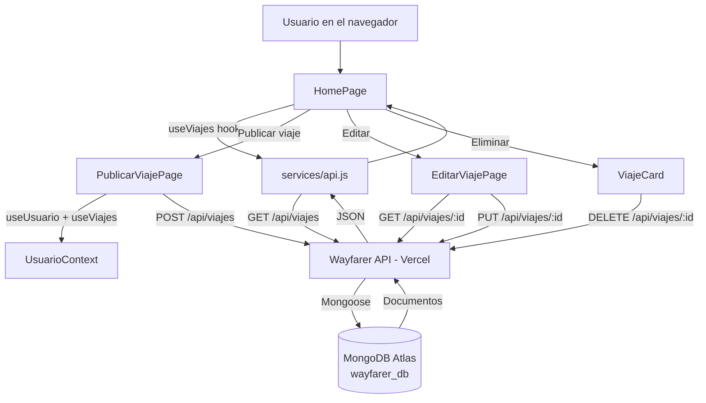

# Wayfarer — Frontend (PEC4)

Interfaz en React para **Wayfarer**, la plataforma de viajes compartidos. Se conecta a la API REST construida en la PEC3 (Express + Mongoose + MongoDB Atlas) para listar y publicar viajes con datos reales.

## Repositorios

- **Frontend (este repo):** conecta con la API y muestra la interfaz.
- **Backend / API (PEC3):** https://github.com/OnedeveloperN/wayfarer-api
- **API en producción:** https://wayfarer-api.vercel.app/api/viajes

## Tecnologías

- **React** + **Vite**
- **React Router** — enrutado con carga perezosa (`lazy` + `Suspense`)
- **Tailwind CSS v4** — estilos, siguiendo el sistema de diseño "Kinetic Trust" (PEC1, Google Stitch)
- **Context API** — usuario "logueado" simulado (`UsuarioContext`)

## Estructura del proyecto

```
src/
  components/    componentes reutilizables (ViajeCard, ViajeForm, Button, ...)
  pages/         vistas de la app (HomePage, PublicarViajePage, EditarViajePage)
  context/       contextos globales (UsuarioContext)
  hooks/         hooks personalizados (useViajes, useUsuario)
  services/      llamadas centralizadas a la API (api.js)
  config/        constantes de configuración (API_BASE_URL, ...)
```

Los imports dentro de `src/` usan el alias absoluto `@/` (configurado en `vite.config.js`), por ejemplo `import Button from '@/components/Button.jsx'`.

## Instalación y ejecución

### Backend (API de la PEC3)

```bash
git clone https://github.com/OnedeveloperN/wayfarer-api.git
cd wayfarer-api
npm install
cp .env.example .env   # completar MONGODB_URI
node server.js
```

Por defecto queda escuchando en `http://localhost:4000`.

### Frontend (este proyecto)

```bash
npm install
cp .env.example .env   # completar VITE_API_URL
npm run dev
```

Por defecto Vite lo levanta en `http://localhost:5173`.

## Variables de entorno

| Variable | Descripción | Ejemplo |
|---|---|---|
| `VITE_API_URL` | URL base de la API de Wayfarer | `https://wayfarer-api.vercel.app/api` (producción) o `http://localhost:4000/api` (local) |

Definidas en `.env` (no versionado), siguiendo `.env.example`.

## Endpoints usados

Todos bajo `VITE_API_URL` + `/viajes`:

| Método | Ruta | Usado en |
|---|---|---|
| `GET` | `/viajes` | `HomePage` — listado de viajes |
| `GET` | `/viajes/:id` | `EditarViajePage` — cargar el viaje a editar |
| `POST` | `/viajes` | `PublicarViajePage` — crear un viaje nuevo |
| `PUT` | `/viajes/:id` | `EditarViajePage` — guardar cambios |
| `DELETE` | `/viajes/:id` | `ViajeCard` (desde `HomePage`) — eliminar un viaje |

## Usuario actual (simulado)

La API todavía no expone endpoints de autenticación ni de usuarios (`/api/usuarios`), pero el modelo `Viaje` requiere un `conductor` (referencia a `Usuario`). Mientras tanto, `UsuarioContext` simula un único usuario "logueado" con un `_id` real insertado en la base. Cuando se implemente login real, este Provider es el punto de reemplazo.

## Flujo de la aplicación



## Despliegue

Desplegado en Vercel, con `VITE_API_URL` configurada en el panel de variables de entorno de Vercel (no expuesta en el código fuente).

- **URL de producción:** _(completar tras el despliegue)_
